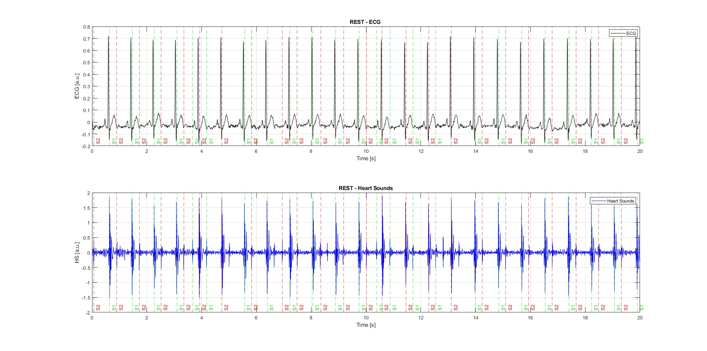
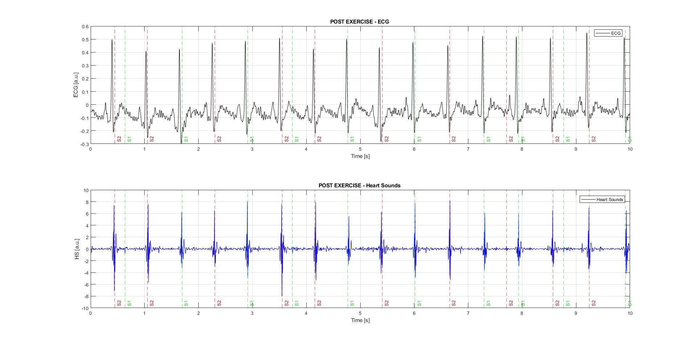

# Physiological-Signal-Analysis-for-Heart-Sound-Detection
## Project Overview

This project implements a MATLAB-based signal processing pipeline for detecting and classifying heart sounds (S1 and S2) from physiological recordings. The detected heart sound events are also visualized together with ECG signals in rest and post-exercise conditions.

## Main Steps

- Load ECG and heart sound recordings sampled at 500 Hz
- Segment the data into rest and post-exercise intervals
- Apply wavelet-based preprocessing using db6 wavelets
- Extract a third-order Shannon energy envelope
- Apply adaptive thresholding using the 55th percentile of the envelope
- Remove short noise-related gates and merge close gates
- Detect candidate heart sound peaks within each gate
- Classify detected events as S1 and S2 based on physiological timing
- Visualize ECG and heart sound signals with detected S1/S2 markers

## Data

The original physiological recording file is not included due to privacy and academic data-sharing restrictions.

To run the code, provide a two-column `.txt` file named `ecg_3.txt`:

- Column 1: heart sound signal
- Column 2: ECG signal
- Sampling rate: 500 Hz

## Limitations

This project was developed as an academic signal-processing prototype. The detection method is rule-based and depends on signal quality, threshold selection, and noise level. Performance is better in cleaner rest recordings, while noisier or post-exercise segments may lead to false detections and require further tuning.

## Example Results

### Rest Condition

### Post-Exercise Condition

